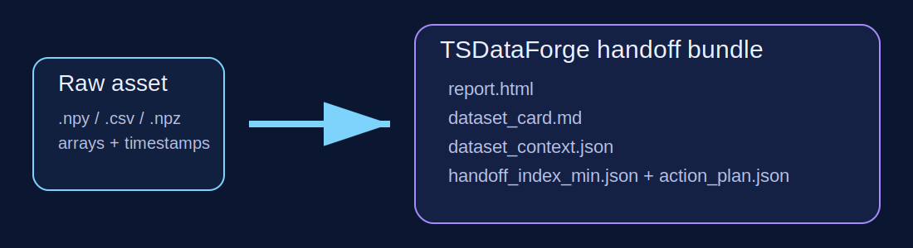
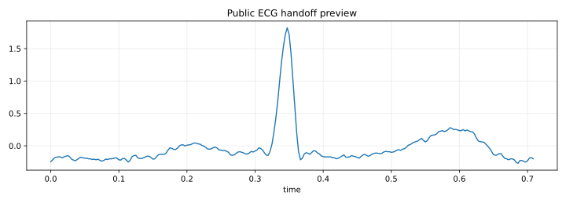
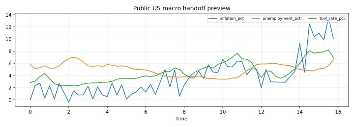
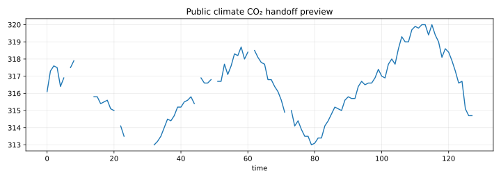
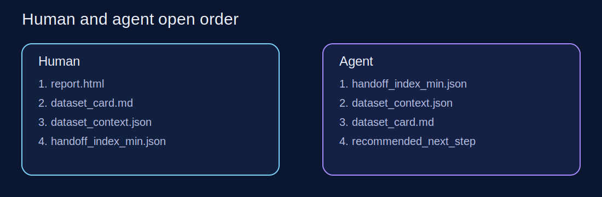

# TSDataForge

> **Turn raw time-series data into profiling reports, handoff bundles, and clear next steps.**

<p align="left">
  <a href="https://zipengwu365.github.io/TSDataForge/"></a>
  <a href="https://github.com/ZipengWu365/TSDataForge"></a>
  <a href="LICENSE"></a>
  
</p>

<p align="left">
  <a href="https://www.birmingham.ac.uk/">
    
  </a>
  Built by <strong>Zipeng Wu</strong> (<a href="mailto:zxw365@student.bham.ac.uk">zxw365@student.bham.ac.uk</a>) at <strong>The University of Birmingham</strong>.
</p>

<p align="left">
  <sub>
    <a href="https://www.birmingham.ac.uk/">University page</a> -
    <a href="https://github.com/ZipengWu365/TSDataForge">GitHub repo</a> -
    <a href="https://zipengwu365.github.io/TSDataForge/">Docs</a>
  </sub>
</p>

TSDataForge is a **time-series profiling and handoff layer**.

It is designed for the moment **before** you pick a model zoo, estimator, or forecasting benchmark. Give it a raw time-series dataset and it returns a:

- **report** for humans
- **dataset card** for handoff
- **compact context** for machine-readable handoff
- **decision record** for explicit next-step logic
- **next-action plan** for routing the dataset into the right downstream task

It is **not** mainly a forecasting toolkit.
It is **not** trying to replace `sktime`, `Darts`, `tsfresh`, `STUMPY`, or `YData Profiling`.
It sits **between raw data and downstream modeling**.

Docs site:
[zipengwu365.github.io/TSDataForge](https://zipengwu365.github.io/TSDataForge/)

<p align="center">
  
</p>

> **Give TSDataForge one raw time-series dataset and it returns a report, a dataset card, a compact context, an explicit decision record, and the next steps in about one second.**

---

## Why use it

Use TSDataForge when you want to:

- understand a raw time-series dataset **before** choosing a model
- turn a raw file into a **shareable profiling report + handoff bundle**
- hand a dataset to another researcher, teammate, or automation flow **without pasting raw arrays**
- keep one base dataset reusable across forecasting, anomaly, regime, causal, control, or similarity workflows
- save **schemas, cards, contexts, and explicit next actions** next to the dataset asset

Do **not** reach for TSDataForge first if your only question is:

- which estimator should I train?
- which deep forecasting stack should I benchmark?
- which feature extractor should I compare?

In those workflows, TSDataForge usually comes **before** or **around** the modeling library.

---

## Three real public demos

These are the flagship demos for a new GitHub visitor. They start from **real public data**, not only reality-shaped synthetic samples.

| Demo | Why it matters | Python call |
|---|---|---|
| **Public ECG arrhythmia handoff** | real biomedical signal windows; good for event/anomaly routing | `demo(output_dir="ecg_bundle", scenario="ecg_public")` |
| **Public US macro handoff** | real inflation / unemployment / T-bill windows; good for regime-aware routing | `demo(output_dir="macro_bundle", scenario="macro_public")` |
| **Public climate CO2 handoff** | real weekly atmospheric CO2 with trend, seasonality, and missingness | `demo(output_dir="climate_bundle", scenario="climate_public")` |

Source notes and provenance:
[docs/public_data_provenance.md](docs/public_data_provenance.md)

<p align="center">
  
</p>

<p align="center">
  
</p>

<p align="center">
  
</p>

Synthetic showcase bundles are still available for deterministic demos:

- `icu_vitals`
- `macro_regime`
- `factory_sensor`
- `synthetic`

There is also a public physical-science demo that is not yet promoted on the first screen:

- `sunspots_public`

---

## The five APIs to remember

| API | What it does | Returns | Why it exists |
|---|---|---|---|
| `load_asset(source, time=None, dataset_id=None, channel_names=None)` | load files or arrays into a TSDataForge asset | `SeriesDataset` or `TaskDataset` | one obvious loader for `.npy`, `.npz`, `.csv`, `.txt`, `.json`, or raw arrays |
| `report(source, output_path="report.html")` | generate the first human-readable profiling artifact | `EDAReport` | the package should feel like a time-series profiling layer before it feels like a toolkit |
| `handoff(source, time=None, output_dir="handoff_bundle", dataset_id=None, channel_names=None)` | package report, card, context, decision logic, schemas, and next actions | `DatasetHandoffBundle` | shortest path from raw asset to reusable output |
| `taskify(source, task=..., time=None, channel_names=None, ...)` | derive a task-specific dataset after the asset is understood | `TaskDataset` | taskification should come **after** understanding |
| `demo(output_dir="demo_bundle", scenario=...)` | generate a built-in demo bundle | `DatasetHandoffBundle` | every public repo needs a credible copy-paste first success |

---

## The shortest happy path

```text
dataset -> report -> handoff bundle -> next action
```

### Install

From GitHub:

```bash
pip install "git+https://github.com/ZipengWu365/TSDataForge.git"
```

From a local clone with visualization extras:

```bash
pip install ".[viz]"
```

PyPI publishing is not live yet, so `pip install tsdataforge` will not work until a package release is published there.

### 60-second path

```python
from tsdataforge import demo

bundle = demo(output_dir="demo_bundle", scenario="ecg_public")
print(bundle.output_dir)
```

Open `demo_bundle/report.html` first.

Docs and showcase pages:
[zipengwu365.github.io/TSDataForge](https://zipengwu365.github.io/TSDataForge/)

## Use your own data

TSDataForge accepts:

- saved `.npy`, `.npz`, `.csv`, `.txt`, or `.json` files
- raw NumPy arrays
- arrays you extracted from a pandas DataFrame

### Fastest path: one saved file

```python
from tsdataforge import report

report(
    "my_sensor_windows.npy",
    output_path="report.html",
    dataset_id="pump_lab_run",
)
```

Open `report.html` first. If you later want a shareable folder with card/context/index sidecars, call `handoff(...)` on the same file.

### If your data starts in pandas

Use this path when your CSV has headers, timestamps, or explicit channel names:

```python
import pandas as pd
from tsdataforge import handoff, report

df = pd.read_csv("pump_run.csv")
values = df[["temperature", "pressure"]].to_numpy()
time = df["seconds"].to_numpy()

report(
    values,
    time=time,
    output_path="report.html",
    dataset_id="pump_run",
    channel_names=["temperature", "pressure"],
)

bundle = handoff(
    values,
    time=time,
    output_dir="pump_bundle",
    dataset_id="pump_run",
    channel_names=["temperature", "pressure"],
)
```

### Shape rules that matter

- `values.shape == (length,)` means one univariate series
- `values.shape == (n_series, length)` means one row per series
- `values.shape == (length, n_channels)` with `time.shape == (length,)` means one multichannel series over time
- `values.shape == (n_series, length, n_channels)` means many multichannel series

### CSV rule

- Direct `.csv` / `.txt` loading expects **numeric** files
- if the first column is monotonic increasing, TSDataForge treats it as `time`
- otherwise the loaded matrix follows the normal shape rules above
- if your CSV has headers or date strings, read it yourself and pass `values` plus `time=`

There is also a minimal example at [examples/real_csv_to_report_30s.py](examples/real_csv_to_report_30s.py).

### Local GUI

If you want the package to feel like a product instead of a CLI, start the local GUI:

```bash
git clone https://github.com/ZipengWu365/TSDataForge.git
cd TSDataForge
pip install ".[viz]"
python -m tsdataforge ui
```

Then open `http://127.0.0.1:8765/`, drag in one `.npy/.npz/.csv/.txt/.json` file, and let the GUI produce:

- `report.html`
- `dataset_card.md`
- `dataset_context.json`
- `decision_record.json`
- `handoff_index_min.json`

Open these files in this order.

### Human open order

1. `demo_bundle/report.html`
2. `demo_bundle/decision_record.md`
3. `demo_bundle/dataset_card.md`
4. `demo_bundle/dataset_context.json`
5. `demo_bundle/action_plan.json` if you want the full breakdown

### Agent open order

1. `demo_bundle/handoff_index_min.json`
2. follow `agent_open_order`
3. open `action_plan.json` only if more detail is needed
4. execute `recommended_next_step`

<p align="center">
  
</p>

### Why this open order exists

- **report.html** is the fastest human explanation layer
- **decision_record.json** is the explicit routing layer for agents and audits
- **dataset_card.md** is the teammate handoff layer
- **dataset_context.json** is the compact semantic layer for agents
- **handoff_index_min.json** is the tiny first-entry routing contract
- **action_plan.json** is the detailed already_done / recommended / optional plan
- **handoff_bundle.json** is an inventory artifact, not the first thing an agent should read

---

## Copy-paste examples

### From arrays to a report

```python
import numpy as np
from tsdataforge import load_asset, report

values = np.random.default_rng(0).normal(size=(12, 256))
dataset = load_asset(values, dataset_id="lab_measurements")
report(dataset, output_path="lab_report.html")
```

### From file to a handoff bundle

```python
from tsdataforge import handoff

bundle = handoff("my_dataset.npy", output_dir="my_handoff_bundle")
print(bundle.output_dir)
print(bundle.index.recommended_next_step)
```

### After the report: taskify

```python
from tsdataforge import load_asset, taskify

base = load_asset("my_dataset.npy")
forecast = taskify(base, task="forecasting", horizon=24)
forecast.save("forecast_asset")
```

### Real public demo

```python
from tsdataforge import demo

bundle = demo(output_dir="ecg_bundle", scenario="ecg_public")
print(bundle.index.to_min_dict())
```

---

## What the handoff bundle contains

| Artifact | What it is for | Best first use |
|---|---|---|
| `report.html` | outcome-first EDA report | human inspection |
| `dataset_card.md` / `.json` | human + machine-readable dataset summary | teammate handoff |
| `dataset_context.json` / `.md` | compact semantic summary | agent handoff |
| `decision_record.json` / `.md` | explicit facts, risks, candidate tasks, and one next step | routing and audit |
| `handoff_index_min.json` / `.md` | **smallest** first-entry agent contract | first agent read |
| `handoff_index.json` / `.md` | expanded routing map | human/agent routing summary |
| `action_plan.json` / `.md` | detailed already_done / recommended / optional plan | deeper execution guidance |
| `handoff_bundle.json` / `.md` | inventory of everything saved | persistence / auditing |
| `schemas/` | artifact schemas + tool contracts | external tooling / validation |
| `asset/` | optional saved dataset arrays + manifest | reopen raw asset only if needed |

---

## Token story

TSDataForge is designed to reduce prompt bloat.

The guiding idea is simple: **agents should not open raw arrays first**.
They should start from a compact context or the minimal handoff index.

In the latest internal audit, raw JSON from a demo input was about **40,809 tokens**, while:

- `dataset_context.json` was **776 tokens**
- `dataset_card.md` was **696 tokens**
- `handoff_index_min.json` was designed to be the smallest routing contract

The exact numbers depend on the dataset, but the product goal is stable: **read the asset semantically before reading it numerically**.

---

## Where it fits in the ecosystem

TSDataForge is strongest when you need:

- **time-series-specific profiling**
- **dataset handoff**
- **task routing**
- **agent-friendly context + schema artifacts**

It pairs well with:

- `sktime` when you are ready for estimator/pipeline work
- `Darts` when you are ready for forecasting workflows
- `tsfresh` when feature extraction is the next step
- `STUMPY` when motif/discord analysis is the next step
- `YData Profiling` when you want broader tabular profiling around non-sequential assets

---

## Real-world starter ideas

- **medicine**: public ECG handoff, ICU shift handoff, wearable event review
- **economics**: inflation / unemployment / rates routing before forecasting
- **climate**: atmospheric CO2 anomaly and seasonality handoff
- **engineering**: drift / burst / maintenance-aware sensor handoff
- **agent workflows**: compact context + tool contracts + next-step routing

---

## Repo pointers

- `docs/quickstart.md` - fastest first-success path
- `docs/handoff.md` - the central product story
- `docs/showcase.md` - real public demos and showcase ideas
- `docs/agent_playbook.md` - agent-first usage patterns
- `docs/api_reference.md` - public and advanced API map
- `examples/` - runnable scripts
- `notebooks/` - walkthrough notebooks
- `showcase/` - GitHub-facing visual assets

---

## Release note for this local snapshot

This artifact contains the package, docs source, release scaffolding, schemas, and demo assets.
Actual publishing to GitHub Pages or PyPI must still be performed in your external release workflow.
